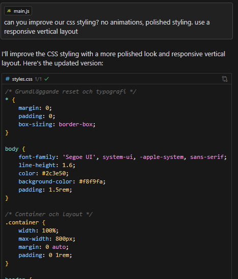
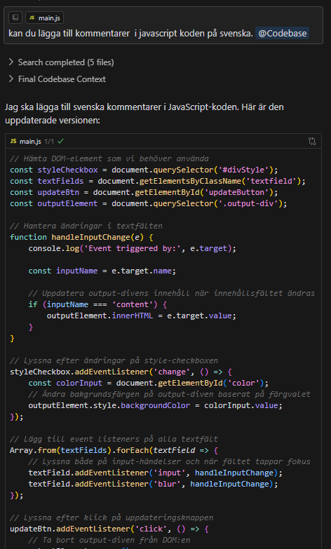
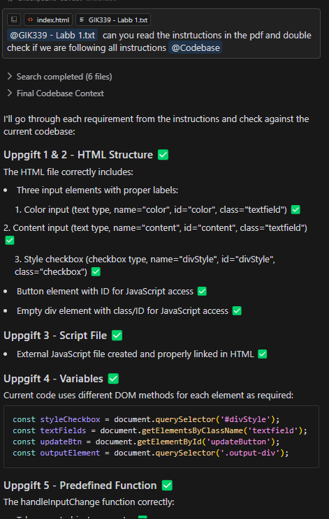

# AI-användningsdokumentation

### CSS-styling förbättring
**Prompt**: "can you improve our css styling? no animations, polished styling. use a responsive vertical layout"
**AI-verktyg**: Claude 3.5 Sonnet

**Sammanfattning av svar**: AI:n förbättrade CSS-stylingen med:
- Grundläggande reset och typografi
- Responsiv vertikal layout
- Polerad styling utan animationer
- Förbättrad läsbarhet och struktur i koden

**Påverkad kod**: `src/css/styles.css`

### Svenska JavaScript-kommentarer
**Prompt**: "kan du lägga till kommentarer i javascript koden på svenska"
**AI-verktyg**: Claude 3.5 Sonnet

**Sammanfattning av svar**: AI:n lade till svenska kommentarer i JavaScript-koden för att förbättra kodens läsbarhet och underhållbarhet:
- Beskrivande kommentarer för DOM-element
- Förklaringar av eventhantering
- Tydlig dokumentation av funktionalitet

**Påverkad kod**: `src/js/main.js`

### Dubbel-kontroll av Labbinstruktioner
**Prompt**: "can you read the instructions in the pdf and double check if we are following all instructions"
**AI-verktyg**: Claude 3.5 Sonnet

**Sammanfattning av svar**: AI:n verifierade att koden följer labbinstruktionerna genom att kontrollera:
- HTML-struktur och element-attribut
- JavaScript-funktionalitet och eventhantering
- Användning av olika DOM-metoder
- Korrekt implementation av alla uppgifter

**Påverkad kod**: Hela kodbasen granskades